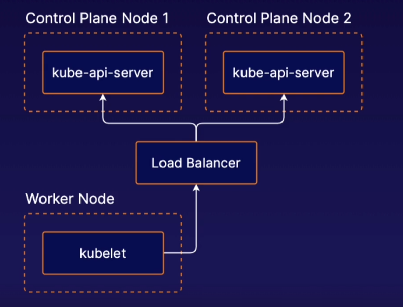
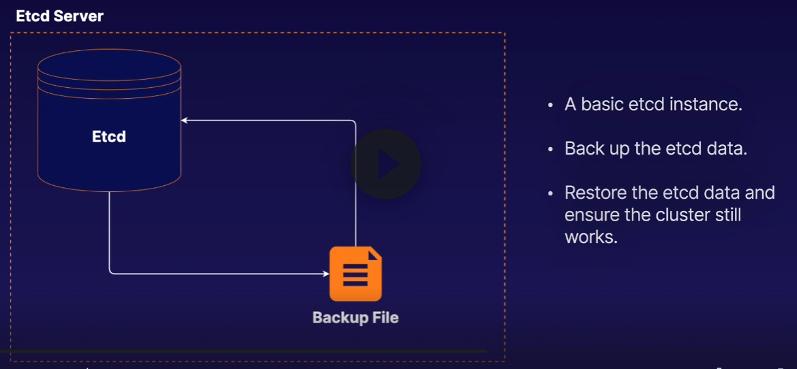
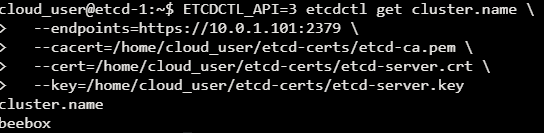
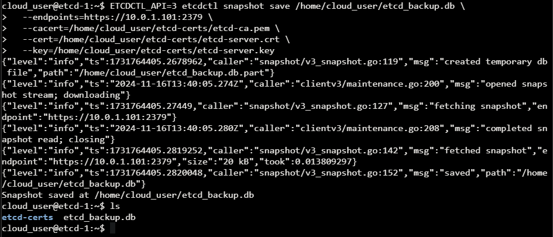
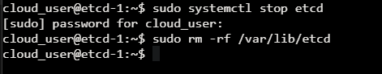
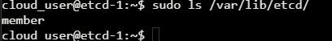
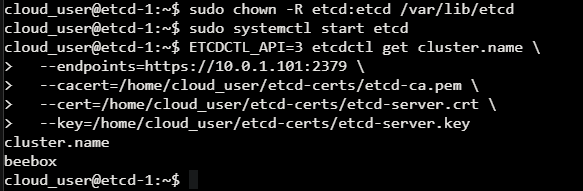

- [High Availability](#high-availability)
      - [Etcd multiple control plane HA K8s set up](#etcd-multiple-control-plane-ha-k8s-set-up)
- [Kubernetes Management Tools](#kubernetes-management-tools)
      - [kubectl](#kubectl)
      - [kubeadm](#kubeadm)
      - [Minikube](#minikube)
      - [Helm](#helm)
      - [Kompose](#kompose)
    - [Kustomize](#kustomize)
- [Safely draining a K8s Node](#safely-draining-a-k8s-node)
- [Upgrading K8s with kubeadm](#upgrading-k8s-with-kubeadm)
- [Backing up and restoring etcd cluster data](#backing-up-and-restoring-etcd-cluster-data)

# High Availability 
  When using multiple control planes for HA you will likely need to communicate through the K8s API through a load balancer. This includes clients such as kubelet instances running on worker nodes
  

  #### Etcd multiple control plane HA K8s set up
  Stacked etcd runs on the same nodes of each control plane node. Each control plane node was have it's own implementation of Stacked etcd

  You can use external Etcd and have multiple instances of Etcd running which allows you have to any number of control instances and etcd instances/ 

  https://kubernetes.io/docs/setup/production-environment/tools/kubeadm/ha-topology/

  # Kubernetes Management Tools

  #### kubectl

Official command line tool and most commonly used tool.

  #### kubeadm

  A tool the allows you to quickly and easily create K8s clusters. 

  #### Minikube

Allows you to automatically set up a local single-node K8s cluser. It is great for getting K8s up and running quikcly for development purposes

  #### Helm

Provides templating and package management solution for K8s objects. You can can use it to turn your own configurations in templates known as charts or uses prebuilt charts to use yourself

  #### Kompose

Helps you translate Docker compose files into Kubernetes objects. If you are using Docker compose for some part of the workflow you can move your application to Kuberenetes easily with Kompose

### Kustomize

Configuration management tool for managing K8s object configurations it's similar to Helm in that it allows you to share and re=use templated configurations for K8s applications.

# Safely draining a K8s Node

When performing maintenance you may someimtes need to remove a K8s node from service. When you drain the node containers running on the node will be gracefully terminated and migrated. 

Use `kubectl drain <node name> --ignore-daemonsets` when daemonsets are in use otherwise this wont work

Use `kubectl uncordon <node name>` to bring a node back out of drain mode

# Upgrading K8s with kubeadm

1. Drain the control node
2. `sudo apt-get update && \ > sudo apt-get install -y --allow-change-held-packages kubeadm=<version>`
3. `sudo kubeadm upgrade plan <version>`
4. Copy the generate upgrade command and run with sudo `sudo kubeadm upgrade apply <version>`
5. Do the same for kubelet and kubectl
6. `sudo apt-get update && \ > sudo apt-get install -y --allow-change-held-packages kubelet=<version> kubectl=<version>`
7. Restart daemon `sudo systemctl daemon-reload`
8. Restart kubelet `sudo systemctl restart kubelet`
9.  `kubectl uncordon <node name>` this will bring back the control node workloads
10. Use `kubectl get nodes` to verify the version
11. Upgrade the workers next start by draining the nodes you may need to use `--force`
12. Log in to the worker node to continue
13. `sudo apt-get update && \ > sudo apt-get install -y --allow-change-held-packages kubeadm=<version>`
14. `sudo kubeadm upgrade node`
15. `sudo apt-get update && \ > sudo apt-get install -y --allow-change-held-packages kubelet=<version> kubectl=<version>`
16. `sudo systemctl daemon-reload`
17. `sudo systemctl restart kubelet`
18. You can now verify all the updates by returning the control node and running `kubectl get nodes`

# Backing up and restoring etcd cluster data

Why back it up? Etcd is the backend storage solution for your entire K8s cluster configuration. This includes objects, applications and configs. If etcd data is lost you will lose all your data. 

You can back up etcd data using the command line tool etcdctl you can also restore using the same command however when restoring you will need more parameters as the operation creates a new logical cluster. 

`ETCDCTL_API=3 etcdctl get cluster.name \
  --endpoints=https://10.0.1.101:2379 \
  --cacert=/home/cloud_user/etcd-certs/etcd-ca.pem \
  --cert=/home/cloud_user/etcd-certs/etcd-server.crt \
  --key=/home/cloud_user/etcd-certs/etcd-server.key`

  

  This command is going to return the name of the cluster.name that is in the etcd server. It uses the private ip address of the etcd server and the port number that the server is open on. 

  `ETCDCTL_API=3 etcdctl snapshot save /home/cloud_user/etcd_backup.db \
  --endpoints=https://10.0.1.101:2379 \
  --cacert=/home/cloud_user/etcd-certs/etcd-ca.pem \
  --cert=/home/cloud_user/etcd-certs/etcd-server.crt \
  --key=/home/cloud_user/etcd-certs/etcd-server.key`

  Now use this command to perform the actual backup. Here is where you specify the backup name

  

  For the purposes of this exercise I have deleted and stopped etcd from running and also deleted all the files assosicated with it. Now all of the data is gone.

  

`sudo ETCDCTL_API=3 etcdctl snapshot restore /home/cloud_user/etcd_backup.db \
  --initial-cluster etcd-restore=https://10.0.1.101:2380 \
  --initial-advertise-peer-urls https://10.0.1.101:2380 \
  --name etcd-restore \
  --data-dir /var/lib/etcd`

  This command will now restore etcd uses the specific file location we backed up. It will now spin up a temporary cluster with the restore data. It will then write out that data back into the etcd directory that we deleted. The cluster will be called etcd-restore. We can verify the restore by looking at the directory

  

  We need to now give permissions on the directory back to the etcd user `sudo chown -R etcd:etcd /var/lib/etcd`

  Now restart etcd `sudo systemctl start etcd`. Verify that etcd is running again and using the correct data by verifying the cluster.name 

  `ETCDCTL_API=3 etcdctl get cluster.name \
  --endpoints=https://10.0.1.101:2379 \
  --cacert=/home/cloud_user/etcd-certs/etcd-ca.pem \
  --cert=/home/cloud_user/etcd-certs/etcd-server.crt \
  --key=/home/cloud_user/etcd-certs/etcd-server.key`

