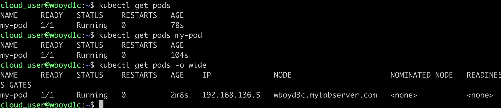
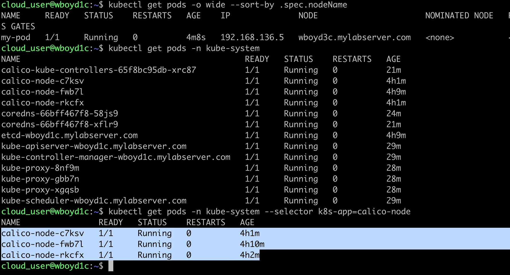
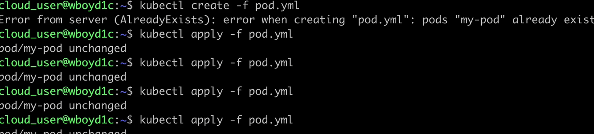
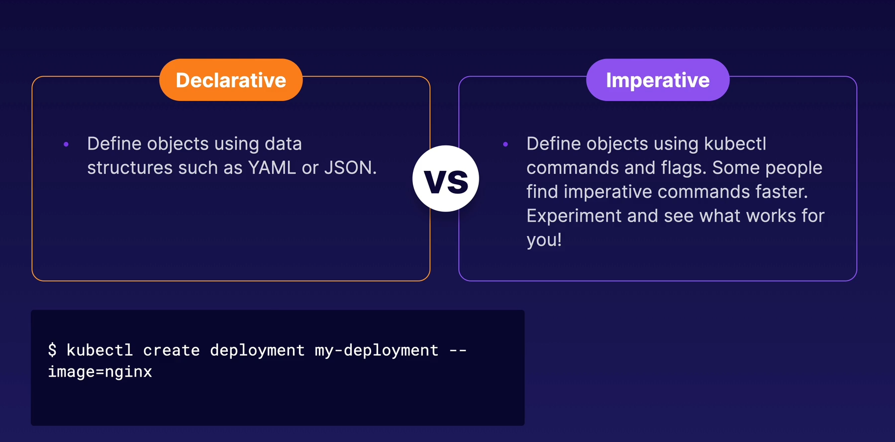
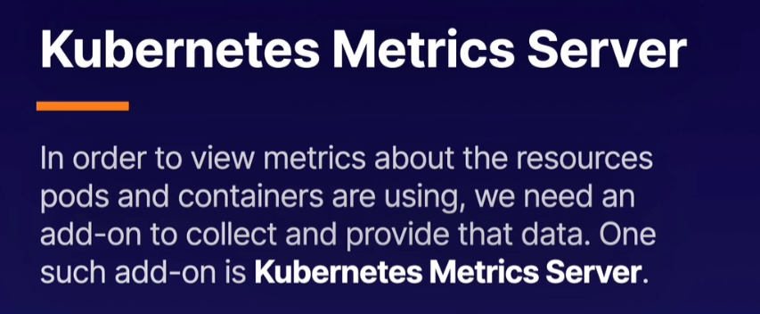
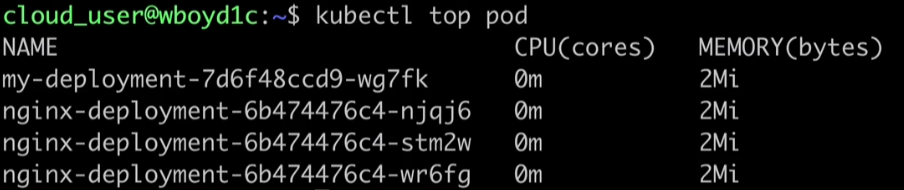

# What is kubectl?

A command line tool that allows you to interact with K8s it uses API the communicate with the cluster and carry out your commands. 

#### kubectl get

Used to list objects within the K8s cluster

`kubectl get <object type> <object name> -o <output> --sort-by <JSONPath> --selector <selector>`

-o Set output format wide, json, yaml are examples of output types
--sort-by Sort output using a JSONPath expression
--selection Filter results by a label

#### kubectl describe

Get detailed information about K8s objects 

`kubectl describe  <object type> <object name>`

#### kubectl create

Allows creation of objects

`kubectl create -f <file name>`

-f Supply a YAML file to create an object(s) described in the file

`kubectl create` will give you a list of all the commands you can use with this for reference

#### kubectl apply

Similar to create but if the object already exists it will modify instead of fail

`kubectl apply -f <file name>`

#### kubectl delete

Used to delete objects

`kubectl delete <object type> <object name>`

#### kubectl exec

Used to run commands inside a container. Very powerful for troubleshotting

`kubectl exec <pod name> -c <container name> --<command>`

#### Declaritive vs Imperative Commands

You can use --dry-tun flag to run a command without creating an object. Combine it with -o yaml to quickly obtain a sample YAMl file you can manipulate.

`kubectl create deployment my-deployment --image=nginx --dry-run -o yaml`

# Pod Metrics and data

`kubectl apply -f https://raw.githubusercontent.com/linuxacademy/content-cka-resources/master/metrics-server-components.yaml`

`kubectl get --raw /apis/metrics.k8s.io/`

Once this is installed we can use kubectl top to view data about resource usage in your pods and nodes. 

`kubectl top pod --sort-by <JSONPATH> --selector <selector>` 

