# Managing Application Configuration

#### Application Configuration 

When you are running applications in K8s. You may want to pass dynamic values to your applications at runtime to control how they behave. 

You can store configuration data in K*s using ConfigMaps. They store data in the form of a key-value map. 

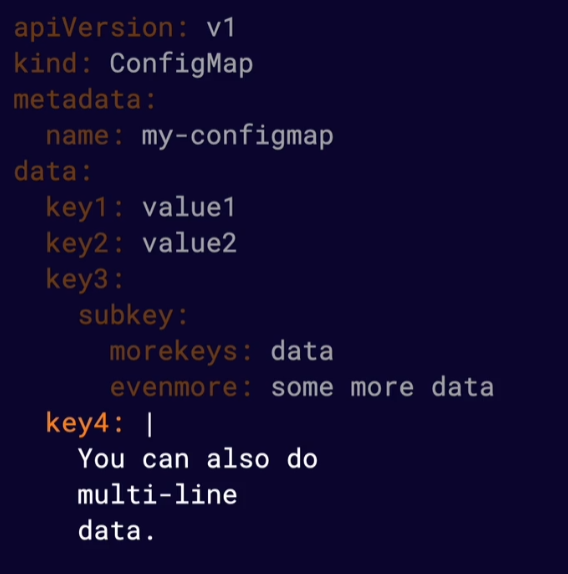

Secrets are similar to ConfigMaps but are designed to store things that are sensitive. 

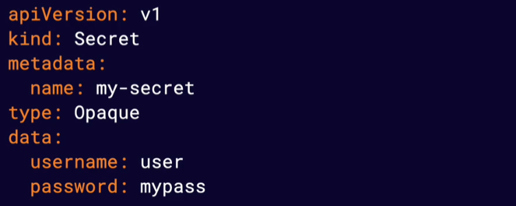

All of the above methods can pass the values through to the containers using environment variables. These are visible at run time only. 

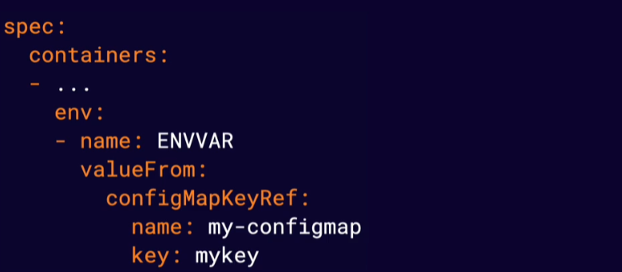

Below is a screenshot of how you would configure a pods yaml file to pass through configmaps or secrets as environment variables to the container.

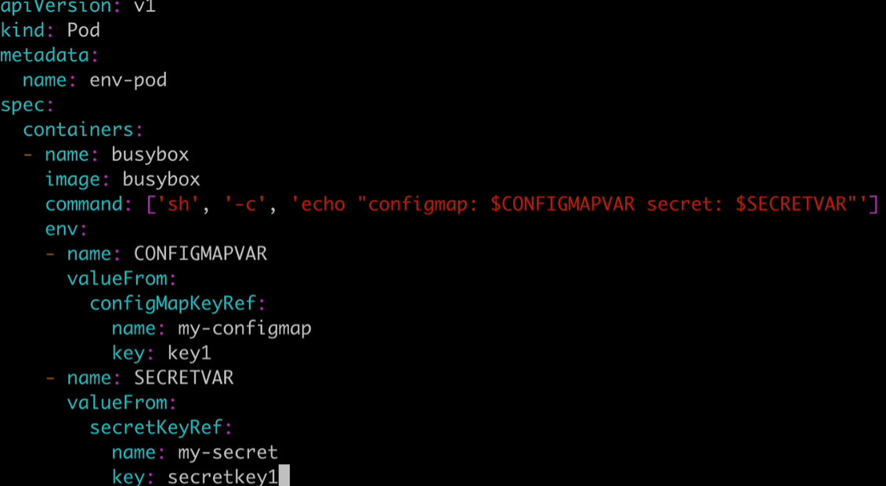

Configuration volumes pass the information in the form of mounted volumes to the container file system. Each top level key will appear as a file containing all keys below that top level key.

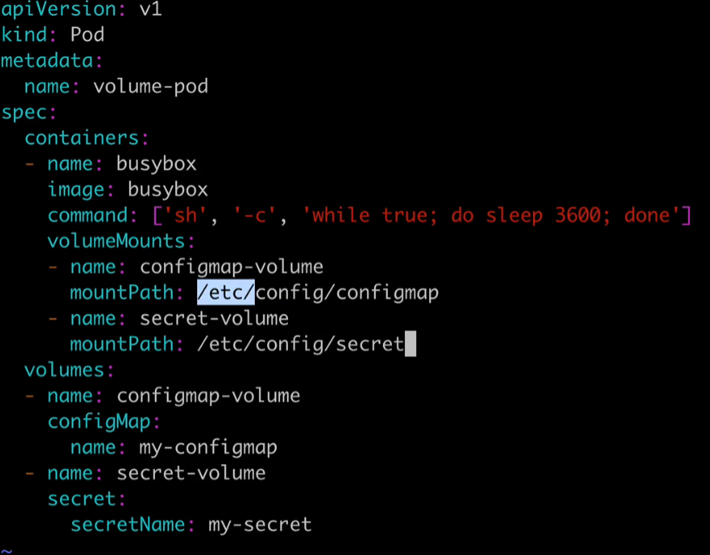
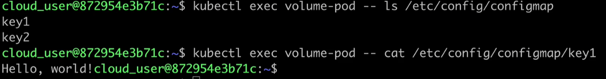
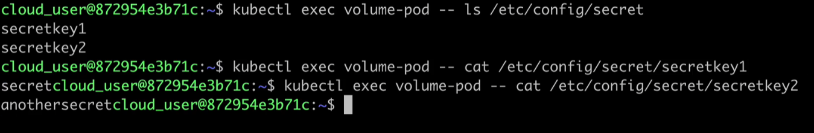

# Managing Container Resources
#### Resource Requests

Resources requests allow us to define an amount of resources such as CPU or Memory you expect a container to use. The K8s scheduler will use resource requests to avoid scheduling pods on nodes that do not have enough available resources. Containers can use more or less resources if needed the resouce request just impacts scheduling. 

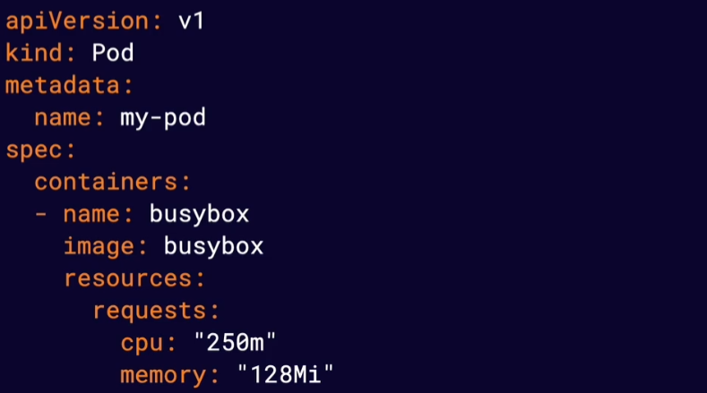

Memory is measured in bytes. CPU is measure in CPU ints which are 1/1000 of one cpu.

#### Resource Limits

Provide a way for you to limit the amount of resources your conatiners can use. The container runtime is responsible for enforcing these limits and different containers runtimes do this differently. Some runtimes will enforce these limits by terminating container processes that attempt to use more than the allowed amount of resources.

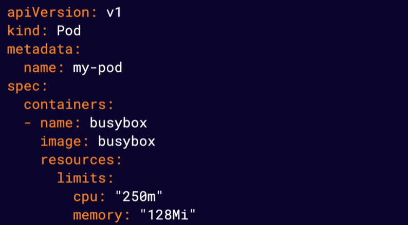

# Monitoring Container Health with Probes

#### Container Health 

K8s provides an ability to automatically restart unhealthy containers. This means actively monitoring container health.

#### Liveness Probes

Allos you to automatically determine whether or not a container application is in a healthy state. By default K*s will only consider a container to be "down" if the container process stops. 

Liveness probes allow you to customise this detection mechanism and make it more sophisticated.

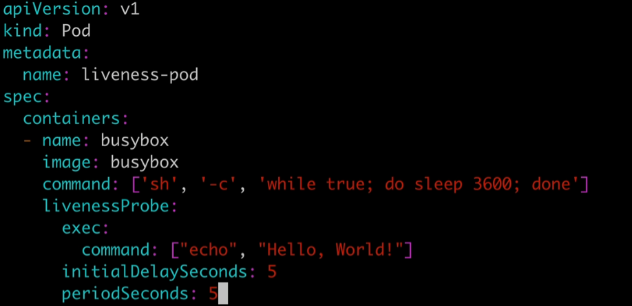

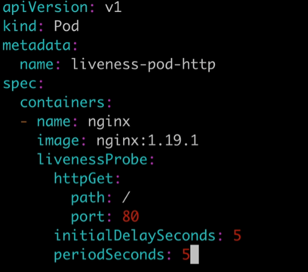

#### Startup Probes

Only run a start and stop once they succeed. Used to detect when an application has successfully started up. Useful for legacy applications that can have long start up times.

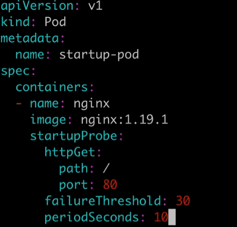

#### Readiness Probes

Determines when a container is ready to accept requests. When you have a service backed by multiple containers user traffic will not be sent to a pod until it's containers have all passed the readiness checks defined by their readiness probes.

Use readiness probes to prevent user traffic from being sent to pods that are still in the process of starting up.

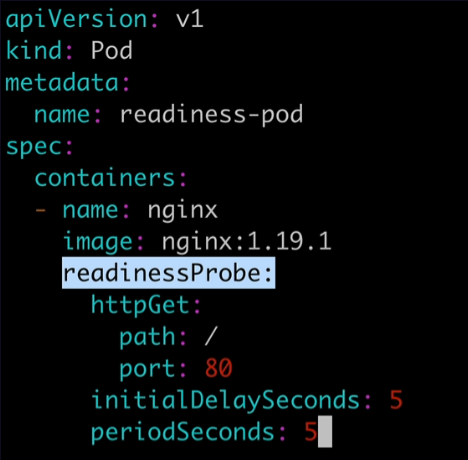

# Building Self-Healing Pods with Restart Polices

#### Restart Policies

Automatically restart containers when they fail. Allow you to customise the behaviout that occurs when you want a container to restart.

##### Always

The default restart policy in K8s. This will always restart containers if they stop even they completed successfully. Use this policy for applications that should always be running.

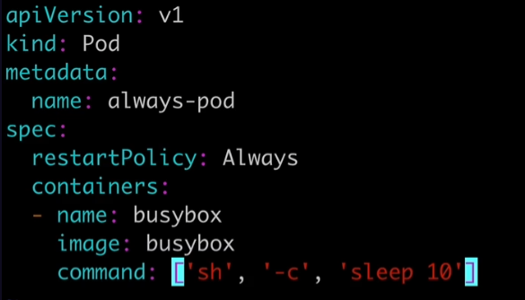

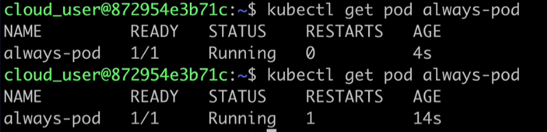

##### OnFailure

Restart the process only if the container process becomes unhealthy or exists with an error code. Use if an application needs to run successfully then stop.

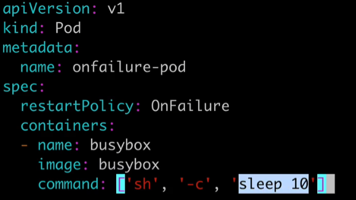

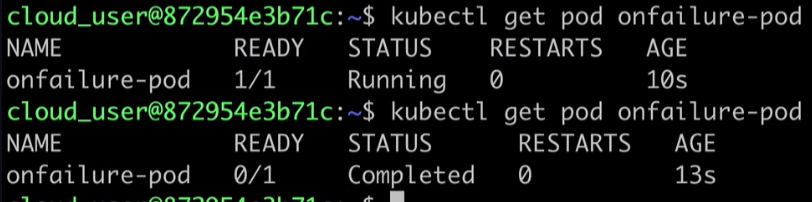

##### Never

Never restarts the pod. Use is the application should only be run once and never be restarted.

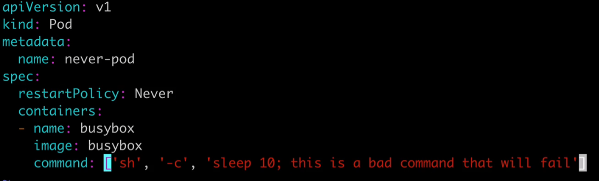

Example

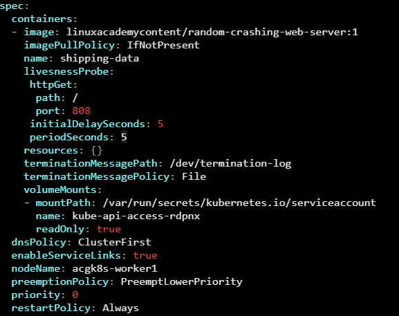

# Creating Multi-Container Pods

K8s can have one or more containers. The containers share resources such as network and storage and can interact with one another to provide functionality. 

It's best practice to keep containers in seperate pods unless they need to share resources

#### Cross Container interaction

Containers share the same networking namespace and can communicate with one another on any port even if that port is not exposed to the cluster. 

Containers can use volumnes to share data in a pod. 

You could use this when have an application that is hard coded to write log output to a file on disk. You could add a secondary container to the pod (sometimes called a sidecar) that reads the log file from a shared volume and prints it to the console so the log output will appear in the container log.

# Introducing Init Containers

These containers run once during the startup process of a pod. A pod can have any number of init containers and they will each run once (in order) to completition. 

Use these to cause a pod to wait for another K8s resource to be created before finishing startup. Also can be used to perform sensitive startup steps securely outside of app containers. They could also be used populate data into a shared volume at startup. They could also be used to communicate with another service at startup. 

# Exploring K8s Scheduling

Scheduling is the process of assigning pods to Nodes so kubelets can run them. A scheduler is a control plane component that handles scheduling.

#### Scheduling Process

The scheduler selects a suitable Node for each Pod. It takes into account 

* Resources requests vs available node resources
* Various configurations that affect scheduling using node labels and other factors.

#### nodeSelector

This limits which Node the Pod can be scheduled on. The use labels to filter suitable nodes.

#### nodeName

Bypass scheduling entirely and assign a Pod to specific Node by using nodeName

# Using DaemonSets

Automatically runs a copy of a Pod on each node. They will run a copy of the pod on new nodes as they are added to the cluster.

#### DaemonSets and Scheduling

Respect normal scheduling rules around node labels, taints and tolerations. If a pod would normally not be scheduled on a node, a DaemonSet will not create a copy of the Pod on that Node.

# Using Static Pods

These are pods that are managed directly by a kubelet on a node and not by the K8s API server. They can run if there is no K8s API server present.

Kubelet automatically creates static pods from YAML manifest files located in the manifest path on the node.

#### Mirror Pods

Kubelet will create a mirror Pod for each static Pod. These allow you to see the status of these pods with the K8s API but you cannot change or manage them via the API. They are essentially ghost representations of those static pods. 

