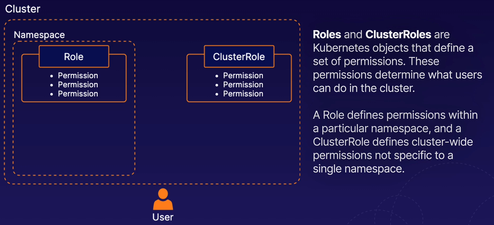
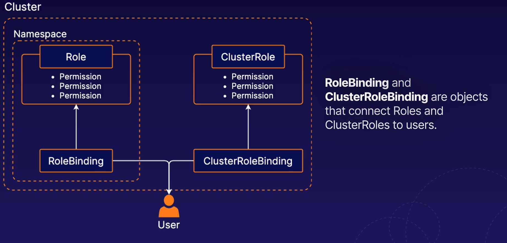

# RBAC in K8s

Allows you to control what users are allowed to do and access within the cluster. For example allow developers to read meta data from pods but not make changes. 

# Creating Service Accounts

A service account is an account used by container processes within Pods to communicate with the K8s api. 

They can be created with YAML similar to other objects

`kubectl create sa my-serviceaccount -n <name space>`

